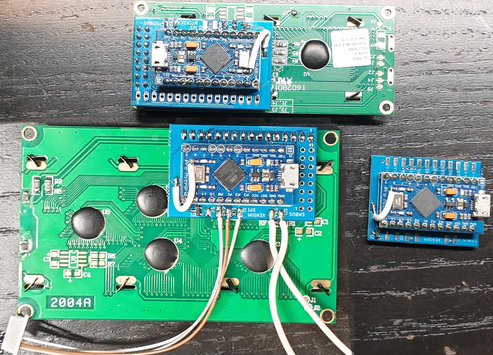
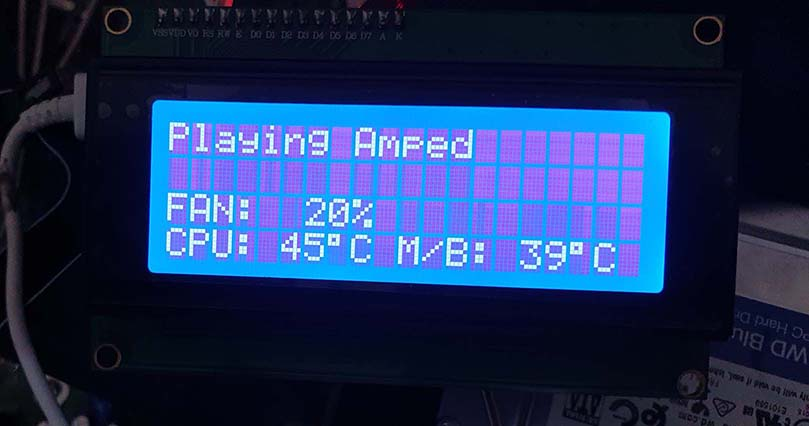
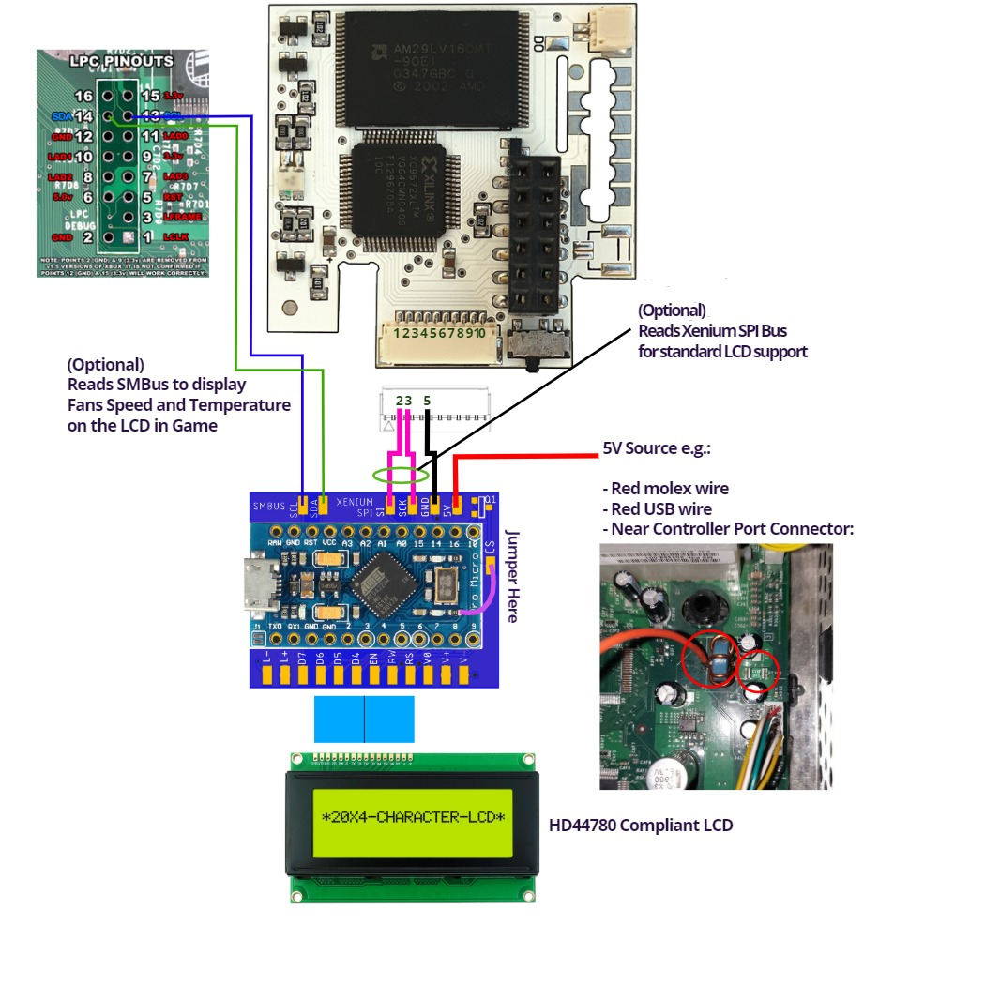
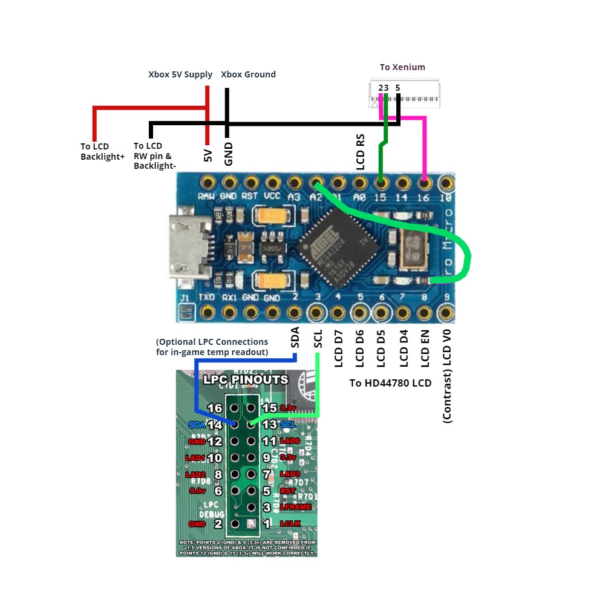

# spi2par2019
  
## What is it?
This is a recreation of a legacy Original Xbox adaptor that allowed you to use extremely common and cheap HD44780 compliant character LCD displays with the Xenium modchip SPI interface. The legacy adaptor was called 'spi2par' and has long since been out of production and extremely hard to come by.

I have never had one either, so this design has been made from the ground up.

There are two PCB layouts in this repository:

1. More faithful to the legacy spi2par design.
2. An LCD backpack design that takes advantage of the standard pinout of most HD44780 LCD displays to minimise the amount of wiring needed.

These two layouts are shown in the below photo. The LCD backpack has two pin arrangements so can be used on the two common LCD pin header layouts as shown installed. The intent is to make this as open and easily accessible to anyone with minimal experience in soldering and programming.  

## Features
1. Converts the Xenium SPI interface to HD44780 compliant parallel LCDs. These are extremely cheap and readily available LCD modules.
2. Software controllable brightness
3. Software controllable contrast
4. This feature never existed in the legacy. You can connect two additional wires to the motherboard LPC header, and the board will read fan speed and MB/CPU temperatures directly from the Xbox System Management bus. It will display and update this mid-game. Traditionally the LCD will just pause until you renter the dashboard.  Example below:  

## Assembly and Materials Required
There is two ways you can do this. Option 1 is the intended way and has a PCB daughter board to make installation easier.    The second option uses less components but requires more wiring.

#### Option 1 - Arduino module and PCB adaptor
The standard design

|Part|Qty | Possible Source|
|--|--|--|
| Ryzee119's spi2par2019 PCB |1| OSHPark (Bit expensive, 3 boards):  [spi2par2019backpack](https://oshpark.com/shared_projects/HGCRYTFI) OR  [spi2par2019faithful](https://oshpark.com/shared_projects/7YvM7Fwu)   Or, Download the required zip file from the [Gerbers Folder](https://github.com/Ryzee119/spi2par2019/tree/master/hardware/gerbers) and upload the zip file to their online ordering service. Use the following PCB properties:   `2 layers, 45x30mm, 1.6mm thick, HASL, 1oz copper, no castellated holes`| 
| Arduino Pro Micro Leonardo 5V/16Mhz |1| [Any clones will work](https://www.aliexpress.com/item/New-Pro-Micro-for-arduino-ATmega32U4-5V-16MHz-Module-with-2-row-pin-header-For-Leonardo/32768308647.html). Make sure they're the 5V/16Mhz variant. | 
| N-Channel MOSFET 2N7002 SOT23 at position Q1| 1 |Find anywhere convenient   [Digikey](https://www.digikey.com.au/short/p4zbn8)  [Aliexpress](https://www.aliexpress.com/item/Free-Shipping-200PCS-2N7002-MOSFET-N-CH-60V-300MA-SOT-23/897983645.html) |
| JST SH1.0 10 pin 1mm connector (To connect to Xenium) | 1 |Digikey: [Connector](https://www.digikey.com.au/product-detail/en/jst-sales-america-inc/SHR-10V-S-B/455-1385-ND/759874) + 3x[Jumpers](https://www.digikey.com.au/product-detail/en/jst-sales-america-inc/ASSHSSH28K152/455-3076-ND/6009452) OR   Aliexpress: [Connector with Jumpers (Get the 10P one)](https://www.aliexpress.com/item/5PCS-100MM-SH-1-0-Wire-Cable-Connector-DIY-SH1-0-JST-2-3-4-5/32952366214.html)|
| General Hook-up Wire 26AWG or so| A metre or two |-|

#### Option 2 - Arduino module only
No extra PCB required, no backlight control, slightly harder soldering

|Part|Qty | Possible Source|
|--|--|--|
| Arduino Pro Micro Leonardo 5V/16Mhz |1| [Any clones will work](https://www.aliexpress.com/item/32768308647.html). Make sure they're the 5V/16Mhz variant. | 
| JST SH1.0 10 pin 1mm connector (To connect to Xenium) | 1 |Digikey: [Connector](https://www.digikey.com.au/product-detail/en/jst-sales-america-inc/SHR-10V-S-B/455-1385-ND/759874) + 3x[Jumpers](https://www.digikey.com.au/product-detail/en/jst-sales-america-inc/ASSHSSH28K152/455-3076-ND/6009452) OR   Aliexpress: [Connector with Jumpers (Get the 10P one)](https://www.aliexpress.com/item/32952366214.html)|
| General Hook-up Wire 26AWG or so| A metre or two |-|

## Programming
1. Clone this repository to your PC
2. Download then install the [Arduino IDE](https://www.arduino.cc/en/Main/Software).
3. Copy `spi2par2019` to your Sketch folder and open the `.ino` file.
4. Set the Board Type the `Arduino Leonardo` and the comport correctly.
5. Compile by clicking the tick in the top left.
5. Confirm it has compiled successfully from the console output.  
6. Connect a MicroUSB cable between the Arduino Module and the PC.   
7. Click the upload button and confirm successful. The LCD backlight should come on but no text will be displayed until connected to a Xenium or the Xbox SMBus.

## Installation

## Alternative Installation

## Further Setup
If using XBMC, there appears to be a bug in the way the large text is printed to the LCD screen when used with a Xenium. This can cause the LCD screen to stop working when the screen saver starts.
It is recommended to edit the /system/UserData/LCD.xml file and replace instances of `LCD.TimeWide21` or `LCD.TimeWide22` with something different. Perhaps `LCD.cputemperature` and `LCD.gputemperature` or if you want time, use the standard font (`System.Time`).
